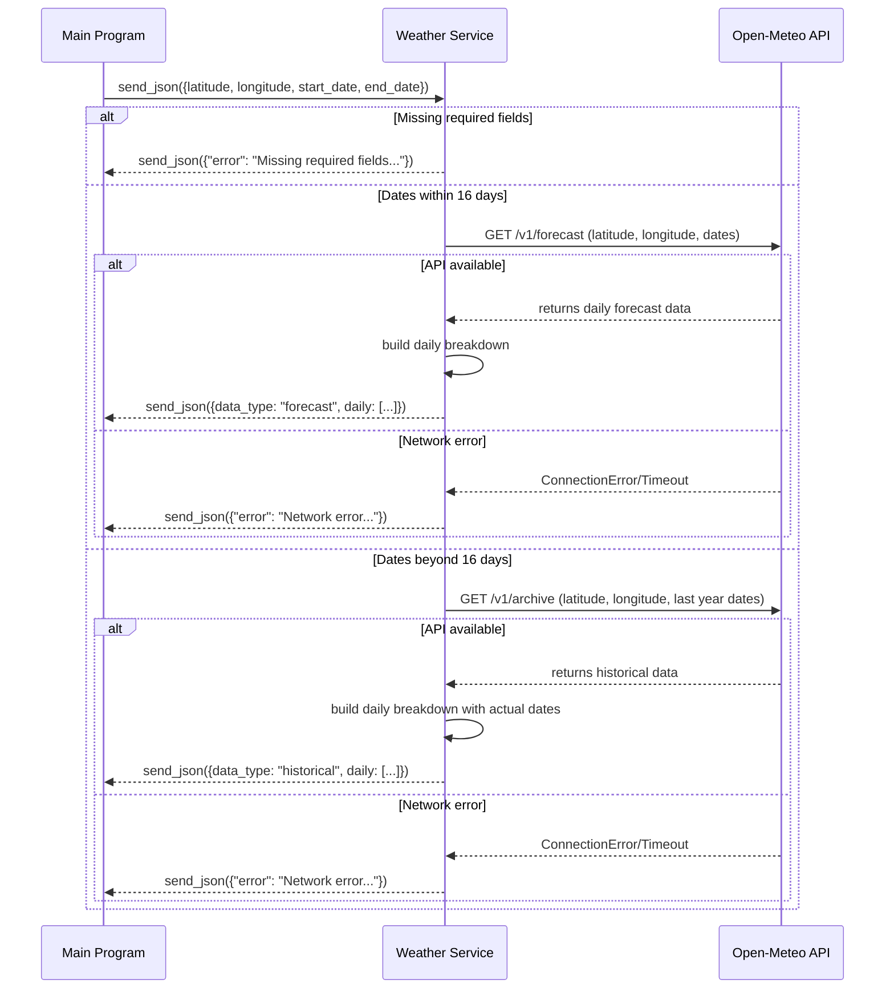

# Weather Service

Weather microservice that returns daily weather breakdown for a given location and travel dates. 
Uses Open-Meteo API to provide forecast data (within 16 days) or historical averages (beyond 16 days) via ZeroMQ.

## Dependencies

```
pip install pyzmq requests
```

## Running the Service

```
python weather.py
```

Runs a ZeroMQ REP socket on `tcp://*:3015`.

## Usage

Send a JSON request with the following required fields:

| Field | Type | Description |
|---|---|---|
| `latitude` | float | Latitude of the location |
| `longitude` | float | Longitude of the location |
| `start_date` | string | Departure date (YYYY-MM-DD) |
| `end_date` | string | Return date (YYYY-MM-DD) |

```json
{"latitude": 48.8566, "longitude": 2.3522, "start_date": "2026-08-10", "end_date": "2026-08-17"}
```

## Response (JSON)

```json
{
  "data_type": "forecast",
  "departure": "2026-08-10",
  "return": "2026-08-17",
  "unit": "C",
  "daily": [
    {
      "date": "2026-08-10",
      "high": 28.5,
      "low": 18.2,
      "conditions": "Partly Cloudy",
      "precipitation_mm": 2.5
    },
    {
      "date": "2026-08-11",
      "high": 30.1,
      "low": 19.0,
      "conditions": "Clear Sky",
      "precipitation_mm": 0.0
    }
  ]
}
```

**Note:** 
- `data_type` will be `"forecast"` if travel dates are within 16 days, `"historical"` if beyond 16 days.
- Temperature unit is always Celsius (`"unit": "C"`). Use the Unit Converter microservice to convert to Fahrenheit if needed.

## Error Responses

| Error | Cause |
|---|---|
| `{"error": "Missing required fields: latitude, longitude, start_date, end_date"}` | One or more required fields missing |
| `{"error": "Network error: Unable to reach weather service. Please try again later."}` | Network/API unavailable |
| `{"error": "No weather data available for the given dates."}` | No data returned from API |

## Example (Python client)

```python
import zmq

context = zmq.Context()
socket = context.socket(zmq.REQ)
socket.connect("tcp://localhost:3015")

socket.send_json({
    "latitude": 48.8566,
    "longitude": 2.3522,
    "start_date": "2026-08-10",
    "end_date": "2026-08-17"
})

response = socket.recv_json()
print(response)

socket.close()
context.term()
```

## UML Sequence Diagram

